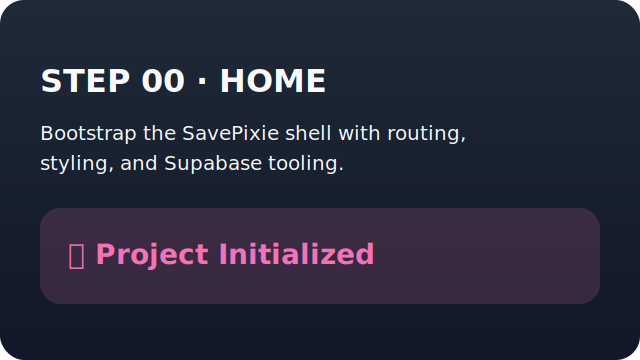

# STEP 00: Initialize Repo & Tooling
## Goal
Bootstrap the SavePixie project with a Vite + React + TypeScript PWA, Supabase client wiring, and GitHub Pages deployment.

## Changes
- Scaffolded a Vite React TypeScript app with routing for `/`, `/auth`, and `/dashboard` plus placeholder screens.
- Added global styling, PWA manifest, generated icons, and a TypeScript service worker that caches the application shell.
- Wired a Supabase client helper, environment template, Prettier and EditorConfig, and Pages deployment workflow.

## SQL
- None (client-only initialization).

## Testing
- `npm run build`

## Screens
- 

## NEXT
- Step 1 – Supabase Auth + Profiles.
