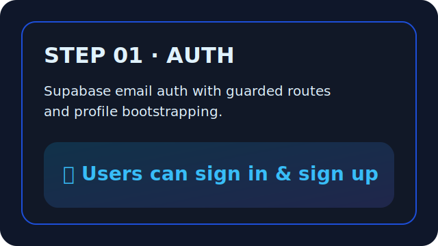

# STEP 01: Supabase Auth + Profiles
## Goal
Deliver password-based authentication with Supabase and bootstrap a `profiles` record for each user.

## Changes
- Implemented `AuthProvider` with Supabase session management, password flows, and profile upserts.
- Added protected routing for `/dashboard` plus refreshed navigation that reflects authentication state.
- Built `/auth` with sign-in, sign-up, and password reset tabs alongside polished form styling.
- Updated dashboard placeholder to greet the authenticated user and highlight upcoming milestones.
- Documented the new flows in the README and created the Step 1 SQL migration for the `profiles` table.

## SQL
- `sql/migrations/001_auth_profiles.sql`

## Testing
- `npm run build`

## Screens
- 

## NEXT
- Step 2 – Savings Goals + Deposits.
